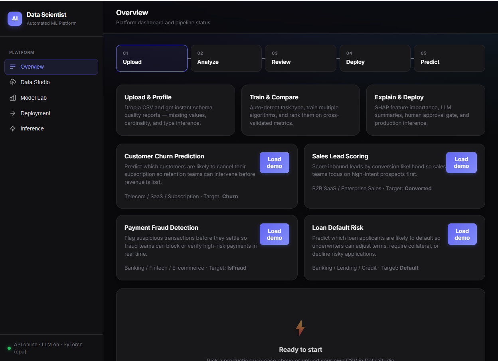
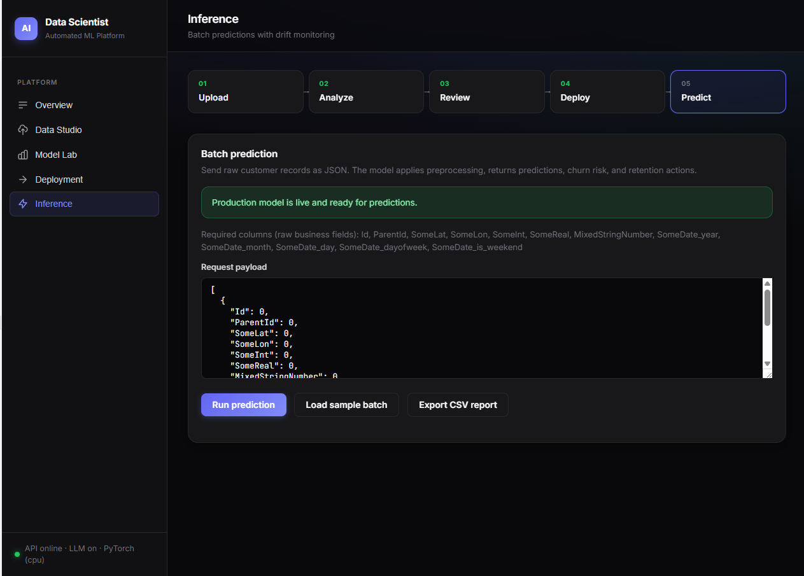
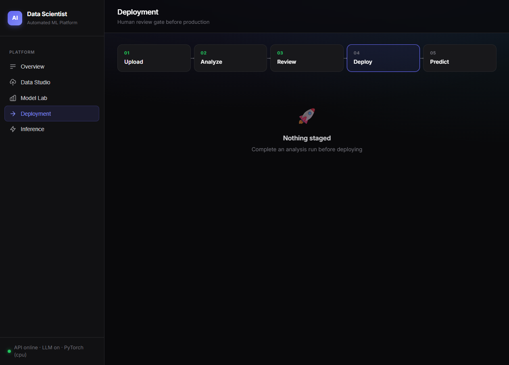

# AI Data Scientist

Live Deployment at https://ai-data-scientist-vdxv.onrender.com

An end-to-end pipeline that takes a raw CSV and produces a cleaned dataset,
compared models, SHAP-based explanations, and a plain-English narrative —
served through a FastAPI backend with a custom web dashboard.

# 📸 Application Screenshots

## 📊 Dashboard



---

## 📁 Data Studio


---

## 🧠 Model Lab


---

## ⚡ AI Inference



---

## 🚀 Deployment



---

## Architecture

```
ai_data_scientist/
├── main.py                     # FastAPI app + serves web UI at /
├── static/                     # Professional web dashboard (HTML/CSS/JS)
│   ├── index.html
│   ├── css/styles.css
│   └── js/app.js
├── start.bat                   # One-click launcher (Windows)
├── dashboard.py                # Legacy Streamlit UI (optional)
├── Dockerfile / docker-compose.yml
└── pipeline/
    ├── ingestion.py            # CSV loading + data profiling
    ├── cleaning.py             # missing values, duplicates, anomaly detection, leakage checks
    ├── feature_engineering.py  # encoding, scaling, datetime features, LLM-suggested features
    ├── problem_detection.py    # infers regression / classification / clustering / time-series
    ├── modeling.py             # trains & cross-validates multiple algorithms, returns leaderboard
    ├── explainability.py       # SHAP values + LLM narrative generation
    ├── tracking.py             # MLflow experiment logging
    ├── monitoring.py           # prediction logging + simple drift detection
    └── orchestrator.py         # wires every stage together end-to-end
```

## Design principle

Two layers, kept deliberately separate:

1. **Deterministic ML layer** — all statistics, model fitting, and SHAP computation use
   scikit-learn, XGBoost, SHAP, and statsmodels. Results stay reproducible.

2. **LLM orchestration layer** — the LLM suggests domain-specific features and translates
   SHAP output into plain English. It never invents numbers.

## Human review checkpoint

`/analyze` trains a model and saves it to `models/staging/`. Nothing is served from
production until you call `POST /approve`, which copies the staged artifact to
`models/best_model.pkl`.

## Running locally

```bash
pip install -r requirements.txt

# Start everything (API + web UI on one port)
python -m uvicorn main:app --host 127.0.0.1 --port 8000 --reload
```

Or double-click **`start.bat`** on Windows.

Open **http://127.0.0.1:8000** in your browser.

Optional: set `ANTHROPIC_API_KEY` for LLM narratives and feature suggestions.

Legacy Streamlit UI (optional): `python -m streamlit run dashboard.py`

## Docker

```bash
docker compose up --build
```

- API: http://localhost:8000
- Dashboard: http://localhost:8501

## API quick reference

```bash
# Upload
curl -X POST -F "file=@yourdata.csv" http://localhost:8000/upload

# Analyze (stages model for review)
curl -X POST http://localhost:8000/analyze \
  -H "Content-Type: application/json" \
  -d '{"filename": "yourdata.csv", "target_col": "churn"}'

# Approve deployment
curl -X POST http://localhost:8000/approve \
  -H "Content-Type: application/json" \
  -d '{"confirmed": true}'

# Predict (with drift warnings)
curl -X POST http://localhost:8000/predict \
  -H "Content-Type: application/json" \
  -d '{"records": [{"age": 35, "tenure": 24}]}'
```

## MLflow

Each `/analyze` run logs params, metrics, and the staged model to `mlruns/`.
View with:

```bash
mlflow ui --backend-store-uri mlruns
```

## Extending

- Swap in AutoGluon/PyCaret in `modeling.py` for broader AutoML coverage
- Add Evidently for richer drift dashboards on top of `monitoring.py`
- Wire approval into your CI/CD or Slack for production governance
